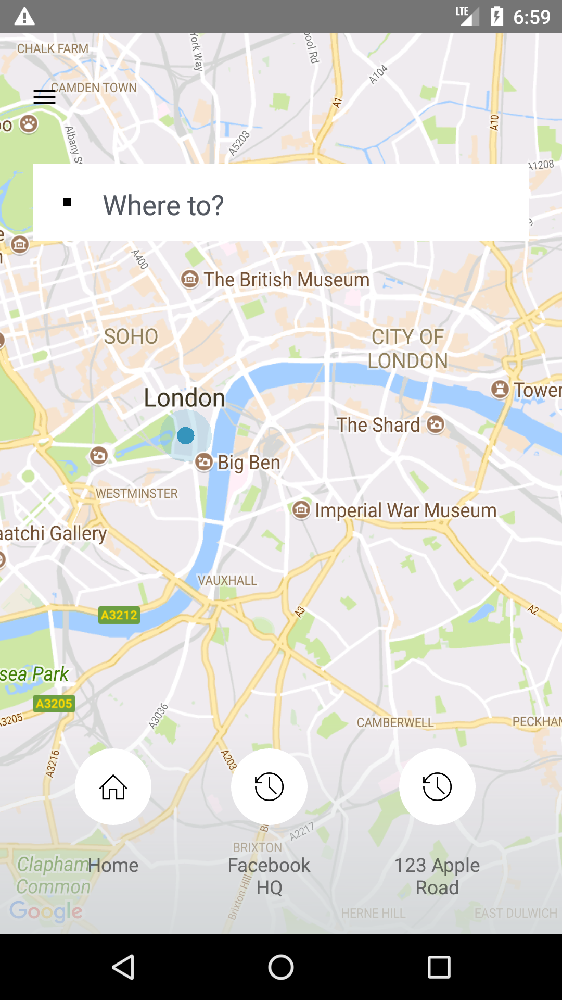

# uber-clone-react-native
Uber UI/UX Clone in React Native

## Sample


## TODO
   * [x] Find a solution to the @override error
   * [x] Update React.checkPropTypes to prop-types since React 16 has complete removed
   * [x] Update React.createClass to create-react-class since React 16 has complete removed

## Steps to run the project

### First Step
Clone Project

### Second Step
Open project folder on console and run

```sh
npm install
npm link
```

### Third Step
Run the Android or IOS project if you get an @override error relative to <\br>
node_modules\react-native-maps\lib\android\src\main\java\com\airbnb\android\react\maps\MapsPackage.java
then delete @override on line 27 from this file MapsPackage.java
